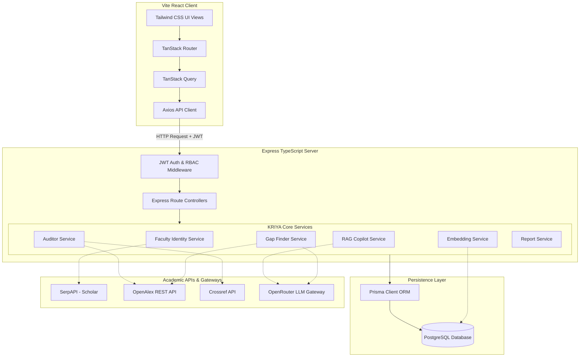

# KRIYA — AI-Powered Institutional Research Platform (IRP)

[](https://vite.dev/)
[](https://react.dev/)
[](https://www.typescriptlang.org/)
[](https://tailwindcss.com/)
[](https://expressjs.com/)
[](https://www.prisma.io/)
[](https://www.postgresql.org/)
[](LICENSE)

KRIYA is an enterprise-grade SaaS platform engineered for academic institutions to consolidate, analyze, and enrich research publication records. Built around a unified academic data model, it integrates global metadata graphs (Google Scholar, OpenAlex, and Crossref) to eliminate manual citation tracking and data inconsistency. KRIYA features a deterministic local text embedding engine for semantic research gap identification and faculty collaboration matchmaking, combined with a production-grade data integrity auditor and an accreditation-ready reporting engine.

---

## Short Description
KRIYA (Institutional Research Platform) is a modern web application designed for universities to manage research publication portfolios. By synchronizing academic profiles across Google Scholar, ORCID, and Crossref, KRIYA consolidates publications, automates citation metric calculation, and tracks institutional research performance. Featuring a localized vector space similarity engine and a RAG (Retrieval-Augmented Generation) copilot, the platform provides research gap discovery and generates NAAC and NIRF-ready compliance reports.

---

## Problem Statement
University research offices (Research Cells) struggle to maintain clean, comprehensive, and up-to-date repositories of faculty and student publications. The manual tracking of citations, h-index, and i10-index scores is labor-intensive and prone to data discrepancies due to inconsistent author name spellings, missing DOIs, and conflicting metadata across repositories (e.g., Scopus, Web of Science, Google Scholar). 

Without automated ingestion and audit checks:
1. **Accreditation Delays**: Generating institutional reports for national rankings and accreditations (like NIRF or NAAC Criterion 3) takes weeks of manual verification.
2. **Metadata Fragmentation**: Research records remain siloed in faculty profiles or separate Excel files.
3. **Missed Collaborative Opportunities**: Departments cannot easily identify strategic research gaps or cross-departmental collaboration directions based on research themes.

---

## Solution
KRIYA solves these challenges by serving as a single source of truth for institutional research activity:
* **Academic API Integrations**: Direct connections to Google Scholar (via SerpAPI), OpenAlex, and Crossref enable 1-click and cron-scheduled profile synchronization and DOI metadata enrichment.
* **Research Data Auditor**: Scans records against a 20-issue taxonomy (including invalid DOIs, metadata discrepancies, and author mismatches) using fuzzy string similarity to calculate and improve an institutional "data health score."
* **Local Semantic Intelligence**: Builds a zero-cost, localized 128-dimensional vector space using TF-IDF term weights and character-gram hashing to match faculty collaborations and locate institutional research gaps.
* **NAAC / NIRF Ready Report Engine**: Automatically formats research metrics into exportable CSV datasets or print-ready PDF summaries matching official ranking template specifications.

---

## Key Features

### 1. Unified Research Identity & Profile Sync
* **SerpAPI Google Scholar Integration**: Resolves real-time profile metrics (total citations, h-index, i10-index) and imports publication lists.
* **ORCID & ResearcherID Normalization**: Standardizes profile identifiers to a canonical format and computes a deterministic profile completeness score.
* **Automated Sync Scheduler**: Integrates node-cron jobs that run in the background to automatically update citation counts without user intervention.

### 2. Multi-Tier Submission & Approval Workflow
* **Role-Based Workspaces**: Customized dashboard workspaces for `ADMIN`, `RESEARCH_CELL`, `FACULTY`, and `STUDENT` users.
* **Validation Workflows**: Publications submitted by students and faculty route to a pending review queue monitored by Research Cell Officers, ensuring only peer-reviewed and verified records enter the official database.
* **Notification System**: Triggers email-like inside-platform alerts to notify users when submissions are approved, rejected, or sent back for revision.

### 3. Research Data Auditor & Integrity Engine
* **20-Issue Integrity Scanner**: Detects missing abstracts, keyword gaps, title mismatches, year discrepancies, citation anomalies, and duplicate publications.
* **Explainable Match Confidence**: Utilizes Levenshtein title distance, author overlaps, and exact DOI mapping to compute a 0–100% confidence level.
* **1-Click Auto-Fix Whitelist**: Safely overrides database errors using external open-access metadata when confidence matches are high.

### 4. NAAC & NIRF Compliant Report Engine
* **Accreditation Templates**: Ready-made templates for NAAC Criterion 3.4 and NIRF Research Performance metrics.
* **Dynamic Column Reordering**: Interactive frontend layout selector that lets administrators group and sort columns before export.
* **Multi-Format Exports**: Downloads raw CSV files for data processing or print-formatted PDF summaries.

### 5. AI Research Intelligence Engine
* **Local TF-IDF Vector Embeddings**: Generates normalized vector representations of publications inside PostgreSQL without relying on external paid embedding APIs.
* **RAG Research Copilot**: A secure chat interface utilizing OpenRouter LLM gateways to summarize institutional publications using isolated prompt injection safeguards.
* **Strategic Gap Finder**: Evaluates global research activity (via OpenAlex REST API) against internal publications to compute a deterministic "Opportunity Score" indicating high-potential areas of future research.
* **Collaboration Matchmaker**: Analyzes shared keywords, complementary expertise, and publication history to recommend faculty-to-faculty co-authorships.

---

## How It Works

KRIYA orchestrates data flow between the user interface, backend validation logic, external indexes, and a structured database:

```
[User Action: Add/Sync Paper]
        ↓
[Vite Frontend / TanStack Router] ── (JWT Authorization Header injected via Axios)
        ↓
[Express API Gateway] ─────────────── (Zod Schema Validation & Role Verification)
        ↓
[Service Layer] ───────────────────── (Orchestrates queries to database & external graphs)
   ├── GoogleScholarService ───────── (Fetches Google Scholar via SerpAPI; falls back to mock data if key is missing)
   ├── OpenAlexService / Crossref ─── (Validates DOI and reconstructs abstract from inverted index)
   ├── AuditorService ─────────────── (Calculates Levenshtein title similarity & audit health score)
   └── ResearchEmbeddingService ───── (Generates 128-d term vectors & computes local Cosine Similarity)
        ↓
[Prisma Client ORM]
        ↓
[PostgreSQL Database] ─────────────── (Stores users, profiles, papers, embeddings, and audit history)
        ↓
[Success Response]
        ↓
[Updated UI with Toast Alert]
```

---

## Project Architecture

The application is structured as a decoupled client-server system communicating over a RESTful API:



---

## Folder Structure

The repository is divided into two primary workspaces: `src` (frontend client) and `server` (backend API).

```
kriya-research-repo/
├── server/                     # Backend Workspace (Express, TypeScript, Prisma)
│   ├── prisma/
│   │   └── schema.prisma       # Database schema definition (PostgreSQL)
│   ├── src/
│   │   ├── config/             # DB client configuration and validated Env schemas
│   │   ├── controllers/        # Route handlers executing services logic
│   │   ├── integrations/       # Google Scholar SerpAPI & OpenRouter LLM gateways
│   │   ├── middleware/         # JWT parsing and Role-Based Access Control filters
│   │   ├── routes/             # Mounted express endpoint routers
│   │   ├── services/           # Core business, audit, report, and embedding engines
│   │   ├── utils/              # Resilient fetch retries and math utilities
│   │   ├── validation/         # Zod schemas for input validation
│   │   ├── index.ts            # App startup and graceful shutdown lifecycle hooks
│   │   ├── seed.ts             # Clean development DB seed script
│   │   └── seed_canonical_departments.ts # Department seed runner
│   ├── package.json
│   └── tsconfig.json
│
├── src/                        # Frontend Workspace (TanStack Start, React 19)
│   ├── assets/                 # Brand logos and campus image assets
│   ├── components/             # Reusable UI component blocks (e.g., Sidebars, Tables)
│   ├── features/               # Domain-specific UI features (e.g., approvals, audit, intelligence)
│   │   ├── approvals/          # Submission queue review cards and feedback forms
│   │   ├── audit/              # Health score gauge, issue matrix, and diff view
│   │   ├── auth/               # Custom login/registration screen panels
│   │   ├── intelligence/       # RAG chat console and gap visualization dashboard
│   │   ├── reports/            # Custom report configuration workbench
│   │   └── scholar/            # Scholar connection drawer and sync metrics
│   ├── hooks/                  # TanStack Query query/mutation wrappers
│   ├── lib/                    # CSS class merge helpers (clsx, tailwind-merge)
│   ├── routes/                 # File-based router configurations
│   ├── services/               # HTTP client connectors mapping to backend REST routes
│   ├── styles.css              # Custom Tailwind v4 styling and variables configuration
│   ├── router.tsx              # Router initialization file
│   └── start.ts                # App entry runner
│
├── tsconfig.json               # Shared TypeScript guidelines
├── vite.config.ts              # Vite configuration (TanStack Start + Tailwind plugins)
└── package.json
```

---

## Technology Stack

| Component | Technology | Purpose | Why Chosen |
| :--- | :--- | :--- | :--- |
| **Frontend UI** | React 19 | Component hierarchy builder | Supports rendering performance and modern concurrent features. |
| **Routing** | TanStack Router / Start | Type-safe router | Delivers compile-time type safety for routes, parameters, and query search flags. |
| **Styling** | Tailwind CSS v4.0 | Responsive interface layout | Simplifies design systems using native custom variables and utility rules. |
| **Backend Core** | Express & TypeScript | REST API server framework | Combines lightweight execution speed with type safety across endpoints. |
| **Database ORM** | Prisma | Schema mapping and queries | Generates robust type schemas for TypeScript code matching Postgres tables. |
| **Database** | PostgreSQL | Relational storage database | Provides structured query reliability, relational lookups, and transaction safety. |
| **LLM Gateway** | OpenRouter (via LangChain) | Model-agnostic LLM calls | Connects backend securely to free/commercial LLMs (e.g., Llama 3.3, GPT-4o-mini) dynamically. |
| **Data Enrichment** | OpenAlex & Crossref APIs | Free metadata resolution | Delivers open-access journals and citations without paid api licensing. |
| **Scholar Sync** | SerpAPI | Scholar crawling gateway | Connects reliably to Google Scholar without encountering IP blocks. |

---

## Database Design

KRIYA maps relationships using Prisma ORM. Below is an overview of the core tables:

```
                  ┌──────────────┐
                  │     User     │
                  └──────┬───────┘
                         │ 1
                         │
             ┌───────────┴───────────┐
           1 │                       │ 1
     ┌───────▼───────┐       ┌───────▼───────┐
     │    Faculty    │       │    Student    │
     └───────┬───────┘       └───────┬───────┘
             │                       │
             │                       │
             │   ┌───────────────┐   │
             └───►ResearchAuthor◄────┘
                 └───────┬───────┘
                         │ *
                         │
                  ┌──────▼───────┐
                  │   Research   │
                  └──────┬───────┘
                         │
      ┌──────────────────┼──────────────────┐
    1 │                * │                * │
┌─────▼──────┐     ┌─────▼──────┐     ┌─────▼──────┐
│ Embedding  │     │  Approval  │     │ Snapshot   │
└────────────┘     └────────────┘     └────────────┘
```

### Core Entities & Relationships

1. **User**: Stores login credentials, hashed passwords, and system roles (`ADMIN`, `FACULTY`, `STUDENT`, `RESEARCH_CELL`).
2. **Department**: Defines institutional structure (e.g., Computer Engineering). Connects users together in specific academic units.
3. **Faculty**: Stores ORCID IDs, Scholar Author IDs, citation totals, h-index, and completeness metrics. Linked 1-to-1 with a `User`.
4. **Student**: Stores roll numbers, academic years, and guide assignments. Linked 1-to-1 with a `User`.
5. **Research**: Stores publication metadata, publication years, DOI indices, citations, status, and provenance.
6. **ResearchAuthor**: Connects `Research` records to `Faculty` or `Student` profiles, tracking author order and corresponding flags.
7. **Approval**: Tracks reviewer decisions (Approved, Needs Revision, Rejected) and comments for a given publication.
8. **ResearchEmbedding**: Stores local 128-dimensional TF-IDF vectors representing papers for semantic matching.
9. **ResearchGap**: Stores strategic research opportunities derived by comparing local records with global indices.
10. **CollaborationRecommendation**: Suggests faculty-to-faculty co-authorship paths based on semantic proximity.

---

## API Documentation

All routes require JWT authentication except public registration and login. Pass the token as `Authorization: Bearer <JWT_TOKEN>`.

### 1. Authentication Endpoints

* **`POST /api/auth/register`**
  * *Purpose*: User self-registration (Restricted to `FACULTY` and `STUDENT` roles only).
  * *Request Body*:
    ```json
    {
      "name": "Kushal Birla",
      "email": "kushalbirla2006@gmail.com",
      "password": "password123",
      "role": "FACULTY"
    }
    ```
  * *Response (201 Created)*:
    ```json
    {
      "success": true,
      "data": {
        "user": {
          "id": "u-1234-abcd",
          "name": "Kushal Birla",
          "email": "kushalbirla2006@gmail.com",
          "role": "FACULTY"
        },
        "accessToken": "eyJhbGciOi..."
      }
    }
    ```

* **`POST /api/auth/login`**
  * *Purpose*: Authenticates credentials and returns a JWT token.
  * *Request Body*:
    ```json
    {
      "email": "admin@university.edu",
      "password": "password123"
    }
    ```
  * *Response (200 OK)*:
    ```json
    {
      "success": true,
      "data": {
        "user": {
          "id": "u-5678-efgh",
          "name": "Platform Administrator",
          "email": "admin@university.edu",
          "role": "ADMIN"
        },
        "accessToken": "eyJhbGciOi..."
      }
    }
    ```

### 2. Publication Management Endpoints

* **`POST /api/researches`**
  * *Purpose*: Manually adds a new research publication record.
  * *Request Body*:
    ```json
    {
      "title": "Spatio-Temporal Graph Neural Networks",
      "abstract": "We formulate prediction models on networks...",
      "keywords": ["Graph", "Neural Networks"],
      "researchArea": "Machine Learning",
      "doi": "10.1016/j.graph.2026.01",
      "publicationYear": 2026
    }
    ```
  * *Response (201 Created)*:
    ```json
    {
      "success": true,
      "data": {
        "id": "r-9999-xyz",
        "title": "Spatio-Temporal Graph Neural Networks",
        "status": "DRAFT"
      }
    }
    ```

### 3. Data Integrity & Auditor Endpoints

* **`POST /api/audits/run`**
  * *Purpose*: Triggers an institutional or departmental metadata validation scan.
  * *Response (200 OK)*:
    ```json
    {
      "success": true,
      "data": {
        "runId": "audit-run-2026",
        "recordsScanned": 124,
        "issuesDetected": 8,
        "healthScore": 93.5
      }
    }
    ```

### 4. AI Research Intelligence Endpoints

* **`POST /api/intelligence/query`**
  * *Purpose*: Evaluates natural language queries using semantic local context retrieval.
  * *Request Body*:
    ```json
    {
      "query": "Who is working on Spatio-Temporal graphs?"
    }
    ```
  * *Response (200 OK)*:
    ```json
    {
      "query": "Who is working on Spatio-Temporal graphs?",
      "answer": "According to institutional records, Kushal Birla [1] is active in Spatio-Temporal Graph Neural Networks...",
      "evidence": [
        {
          "researchId": "r-9999-xyz",
          "title": "Spatio-Temporal Graph Neural Networks",
          "authors": "Kushal Birla",
          "year": 2026,
          "source": "KRIYA_Verified_DB"
        }
      ],
      "latencyMs": 140,
      "modelUsed": "meta-llama/llama-3.3-70b-instruct:free",
      "resultStatus": "SUCCESS"
    }
    ```

---

## Authentication & Authorization

KRIYA implements a secure, stateless Authentication & Authorization flow to protect institutional data:

```
[Register/Login Request] ────────────────► [Verify Password via Bcryptjs]
                                                      │
                                                      ▼
[Inject Bearer Header JWT] ◄────────────── [Generate signed JWT Token]
            │
            ▼
[authenticateToken Middleware] ──────────► [Verify signature using JWT_SECRET]
                                                      │
                                                      ▼
[requireRole(AllowedRoles) Middleware] ──► [Verify user role has endpoint access]
```

### Protection Details:
1. **Stateless JWT**: Decoded on each backend route by `authenticateToken` middleware.
2. **Role Hierarchy Access Checks**: Verified via `requireRole(["ADMIN", "RESEARCH_CELL"])` controllers.
3. **Privilege Escalation Protection**: Self-registration enforces Zod checks blocking users from registering as `ADMIN` or `RESEARCH_CELL` through the signup page.

---

## Security

* **Password Protection**: Hashed using `bcryptjs` with a work factor (salt rounds) of 10.
* **SQL Injection Mitigation**: Strictly routes queries through Prisma ORM parameterization.
* **CORS Restrictions**: Express server verifies origins against `CORS_ORIGIN` arrays.
* **LLM Prompt Injection Shielding**: The `RAGResearchCopilotService` sanitizes user queries by stripping HTML/XML tags and blocking prompt bypass commands (`system prompt`, `ignore prior instructions`, etc.) to prevent model override attacks.

---

## Installation

### Prerequisites
* [Node.js](https://nodejs.org/) (v18 or higher)
* [Bun](https://bun.sh/) or NPM package manager
* [PostgreSQL](https://www.postgresql.org/) database instance (e.g. Supabase, local, or RDS)

### Step 1: Clone the Repository
```bash
git clone https://github.com/RoshanGaikwad2006/kriya-research-repo.git
cd kriya-research-repo
```

### Step 2: Configure Environment Variables
Create a `.env` file inside the `server/` directory:
```bash
cp server/.env.example server/.env
# Edit server/.env with your Postgres database url and API keys
```

Create a `.env` file in the root directory for the frontend:
```bash
cp .env.example .env
# Verify VITE_API_BASE_URL points to the backend server (e.g. http://localhost:5000/api)
```

### Step 3: Install Dependencies
Install server-side dependencies:
```bash
cd server
npm install
```

Install client-side dependencies:
```bash
cd ..
npm install
```

### Step 4: Database Migrations and Seeding
Initialize tables and seed default administrator and faculty accounts:
```bash
cd server
npm run prisma:generate
npm run prisma:db:push
# Run default seeds
npx tsx src/seed.ts
npx tsx src/seed_canonical_departments.ts
cd ..
```

### Step 5: Start the Development Servers
Run the Express backend:
```bash
cd server
npm run dev
```

In a new terminal window, run the Vite frontend:
```bash
# From the root directory
npm run dev
```
Open your browser to `http://localhost:5173`. Use credentials `admin@university.edu` / `password123` to log in.

---

## Environment Variables

### Backend Configuration (`server/.env`)

| Variable | Required | Description |
| :--- | :---: | :--- |
| `DATABASE_URL` | **Yes** | PostgreSQL connection string (including username, password, host, port, database). |
| `JWT_SECRET` | **Yes** | Cryptographic key (minimum 16 characters) used to sign authentication tokens. |
| `JWT_EXPIRES_IN`| No | Duration of JWT validity. Defaults to `"7d"`. |
| `PORT` | No | Port on which the Express server runs. Defaults to `5000`. |
| `CORS_ORIGIN` | No | Allowed frontend origin list separated by commas. Defaults to `http://localhost:5173`. |
| `SERP_API_KEY` | No | SerpAPI token used for Google Scholar profile parsing. Defaults to mock data fallback if missing. |
| `OPENROUTER_API_KEY`| No | Key used for the AI Research Copilot and Gap Finder. Defaults to static heuristic matching if missing. |
| `OPENROUTER_MODEL` | No | Target LLM used via OpenRouter. Defaults to `openrouter/auto`. |

### Frontend Configuration (`.env`)

| Variable | Required | Description |
| :--- | :---: | :--- |
| `VITE_API_BASE_URL` | **Yes** | Target API endpoint base URL pointing to the Express server (e.g. `http://localhost:5000/api`). |

---

## Screenshots

Below are placeholders representing the primary core screens of the KRIYA client workspace.

### 1. Welcome and Authentication Screen
*Minimalist split-screen card login featuring brand highlights on the left and input forms on the right.*
`[Screenshot Placeholder: src/assets/kkwagh-campus.jpg]`

### 2. Department Research Analytics Dashboard
*Displays metrics including publication volumes, citation tracking, h-index, and data health scores.*
`[Screenshot Placeholder: Dashboard_Main_View]`

### 3. Research Data Auditor Panel
*Auditor interface detailing metadata comparisons, confidence scores, and conflict resolution options.*
`[Screenshot Placeholder: Auditor_Dashboard_View]`

### 4. Knowledge Graph & AI Copilot Workspace
*Interactive canvas visualizer highlighting node relations alongside the RAG search drawer.*
`[Screenshot Placeholder: Knowledge_Graph_View]`

---

## Usage

### For Faculty Members
1. **Sync Scholar Profile**: Navigate to your profile settings, link your Google Scholar URL or ID, and sync your publication bibliography in seconds.
2. **Resolve Metadata Conflicts**: Review suggestions from the Auditor and click "Accept OpenAlex" or "Accept Crossref" to automatically clean up database entries.
3. **AI Recommendations**: Query the RAG Copilot to see related publications, and review matching profiles on the Collaboration workspace to coordinate new proposals.

### For Research Cell Officers
1. **Review Submissions Queue**: Filter, inspect, and approve pending publication records from faculty or students.
2. **Audit Data Health**: Run institutional-wide scans to flag formatting errors, missing DOIs, and citation mismatches.
3. **Generate Accreditation Reports**: Choose NAAC/NIRF templates, filter by department or year range, reorder target columns, and export CSV/PDF datasets.

---

## Project Workflow

```
[Faculty Submits Paper Details]
             │
             ▼
[Auditor Service Check] ── (Detects DOI validation, Title similarities, and missing abstracts)
             │
             ├────────► [If Confidence < 85%] ──► Flag record for manual verification in RC queue.
             └────────► [If Confidence >= 85%] ─► Stage record for auto-fix whitelist.
             │
             ▼
[Research Cell Review] ─── (Approves details and publishes record to institutional graph)
             │
             ▼
[Incremental Indexing] ── (Generates local TF-IDF text vectors & records keywords)
             │
             ▼
[Copilot Retrieval] ───── (Instantly searchable by RAG and mapped inside the Knowledge Graph)
```

---

## Error Handling

* **Schema Validation**: Backend Zod validators intercept invalid request payloads before routing, returning descriptive HTTP 400 structures:
  ```json
  {
    "success": false,
    "error": {
      "code": "VALIDATION_ERROR",
      "message": "Email address must be a valid institutional domain."
    }
  }
  ```
* **Axios Interceptor**: Catch errors globally on the frontend (`apiClient.ts`) to display Sonner toast notifications (e.g. Session Expired warning on HTTP 401).
* **API Fallbacks**: Gracefully bypass external indexing or LLM network timeouts to prevent application crashes.

---

## Performance Optimizations

* **Local TF-IDF Vector Spaces**: Performs fast cosine similarity math locally using standard term frequencies, bypassing external network latency.
* **Content Hashing Check**: Computes a SHA-256 hash of canonical paper texts during database upsert, skipping embedding updates for unmodified records.
* **Resilient Fetching**: Wraps academic REST endpoints in retry mechanics with exponential backoff timers (`resilientFetch.ts`).

---

## Deployment

### 1. Production Build (Frontend)
Build optimized Static Assets:
```bash
npm run build
```
The output directory `dist/` contains production-ready bundles prepared for hosting on CDN platforms (e.g. Vercel, Netlify).

### 2. Node.js Production Server
Transpile backend TypeScript:
```bash
cd server
npm run build
# Start production server
npm start
```
Configure environment variables on hosting providers (e.g. Render, AWS EC2, Heroku) matching the configurations in the `.env` settings.

---

## Limitations

* **Heuristic Search Limitations**: The localized TF-IDF similarity matcher relies on textual overlapping and does not match synonyms as effectively as dense neural embeddings (e.g., Ada-002) without API integration.
* **Google Scholar Crawl Limits**: Synchronization relies on third-party SerpAPI crawling keys. The system falls back to mock data structures if rate limits are reached.

---

## Future Improvements

* **Dense Vector Database**: Upgrade PostgreSQL vector JSON columns to pgvector for executing multi-dimensional semantic indexing.
* **Double Blind Peer-Review Queue**: Introduce student manuscript staging tables allowing double-blind internal peer-review cycles.

---

## Contributing

1. Fork the repository on GitHub.
2. Create a clean feature branch: `git checkout -b feature/amazing-feature`.
3. Verify formatting: `npm run format`.
4. Commit your changes: `git commit -m 'feat: add amazing feature'`.
5. Push to the branch: `git push origin feature/amazing-feature`.
6. Open a Pull Request.

---

## License

This project is licensed under the MIT License - see the [LICENSE](LICENSE) file for details.

---

## Author

* **Roshan Gaikwad** — *AI Integration Specialist* — [roshangaikwad2006@gmail.com](mailto:roshangaikwad2006@gmail.com)
* **Kalpesh Bire** — *Full Stack Engineer & System Architect* — [kalpeshbire2006@gmail.com](mailto:kalpeshbire2006@gmail.com)


---

## Acknowledgements

* [TanStack Query & Start](https://tanstack.com/) for type-safe state routing.
* [OpenAlex API](https://openalex.org/) and [Crossref](https://www.crossref.org/) for free academic dataset access.
* [LangChain](https://js.langchain.com/) for model orchestration guidelines.
* [Lucide React](https://lucide.dev/) for dashboard icons.
